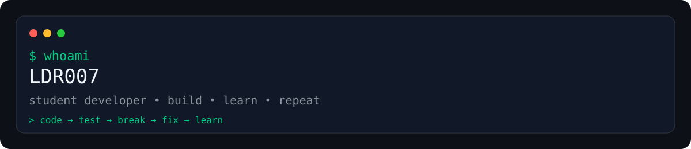

# LDR007 GitHub Profile — setup

## 1. Create the profile repository

Create a PUBLIC repository named exactly:

LDR007

GitHub recognizes `LDR007/LDR007` as the profile README repository.

## 2. Upload

Upload:
- README.md
- .github/workflows/snake.yml
- assets/profile-banner.svg

The banner is optional because the README currently uses a terminal-style
header made directly with Markdown/code. If you prefer the SVG banner, add:

  

near the top of README.md.

## 3. Enable the contribution snake

Commit `.github/workflows/snake.yml` to the LDR007/LDR007 repository.

Run the workflow once manually from:
Actions → Generate contribution snake → Run workflow

After it runs, the `output` branch will contain the generated SVG.

## 4. External statistics

The README uses:
- github-readme-stats
- streak-stats
- Komarev profile views
- shields.io badges

These are external image services. If one becomes unavailable, remove that
image rather than changing the rest of the profile.

## 5. Important

Do not add technologies or projects that are not actually yours. Update the
README whenever your real projects change.
